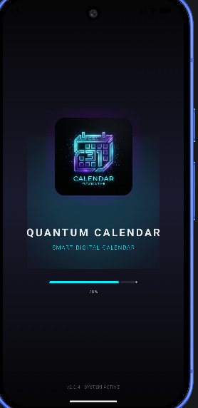

# 📅 MyKalender - Quantum Calendar App

MyKalender adalah aplikasi kalender digital modern dengan tampilan futuristik yang membantu pengguna mengatur jadwal dan agenda harian secara efisien.

---

## 🚀 Fitur Utama

* ✨ Entrance Screen (Loading Screen)
* 🔐 Login & Sign In (Authentication)
* 📆 Dashboard Kalender Interaktif
* ➕ Tambah Agenda / Jadwal

---

## 📸 Tampilan Aplikasi

### 1. 🚪 Entrance Screen

Tampilan awal saat aplikasi dibuka.



---

### 2. 🔐 Login / Sign In

Halaman autentikasi pengguna sebelum masuk ke aplikasi.


---

### 3. 📆 Halaman Utama (Dashboard)

Menampilkan kalender dan informasi jadwal pengguna.


---

### 4. ➕ Fitur Tambah Agenda

Digunakan untuk menambahkan jadwal atau event baru.


---

## 🛠️ Teknologi yang Digunakan

* Android Studio
* Kotlin / Java
* Material UI
* Firebase (opsional)

---

## 📌 Catatan Penting

* Gunakan `%20` untuk spasi pada nama file gambar agar tidak error di GitHub
* Pastikan file gambar sudah di-commit ke repository
* Contoh:

  ```
  git add .
  git commit -m "add images"
  git push
  ```

---

## 📂 Struktur Folder (Opsional - Rekomendasi)

```
MyKalender/
│── Entrance.png
│── Login Sign In.png
│── Tampilan Halaman Utama.png
│── Fitur Tambah Agenda Jadwal.png
│── README.md
```

---

## 💡 Tips

Kalau mau lebih rapi, kamu bisa pindahkan semua gambar ke folder `images/`, lalu ubah jadi:

```

```

---
